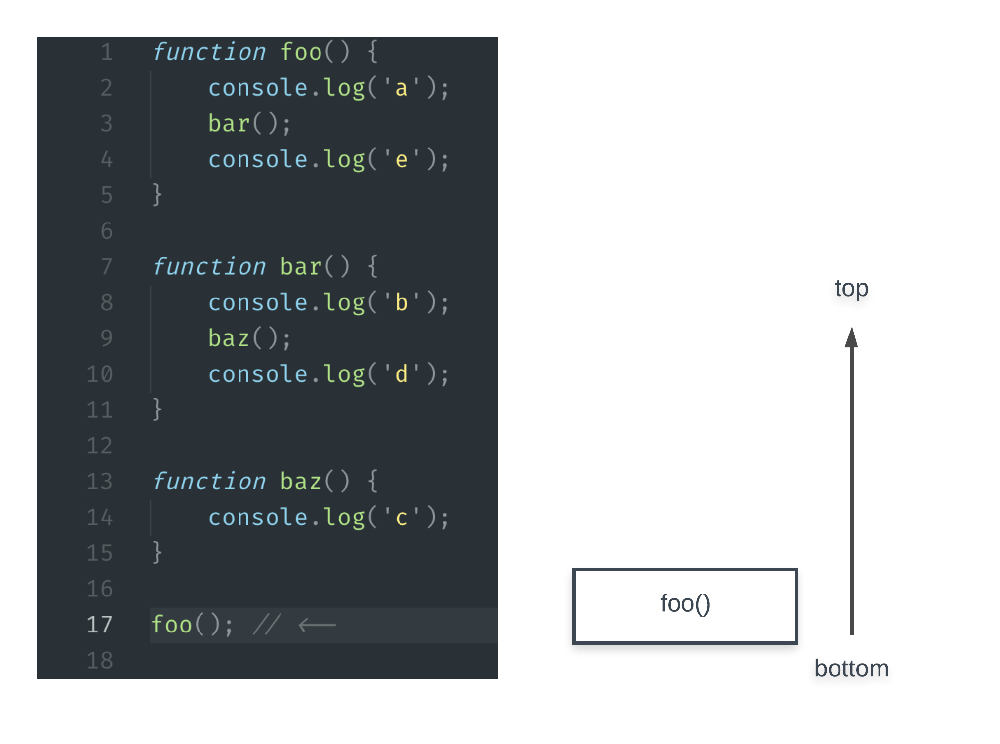
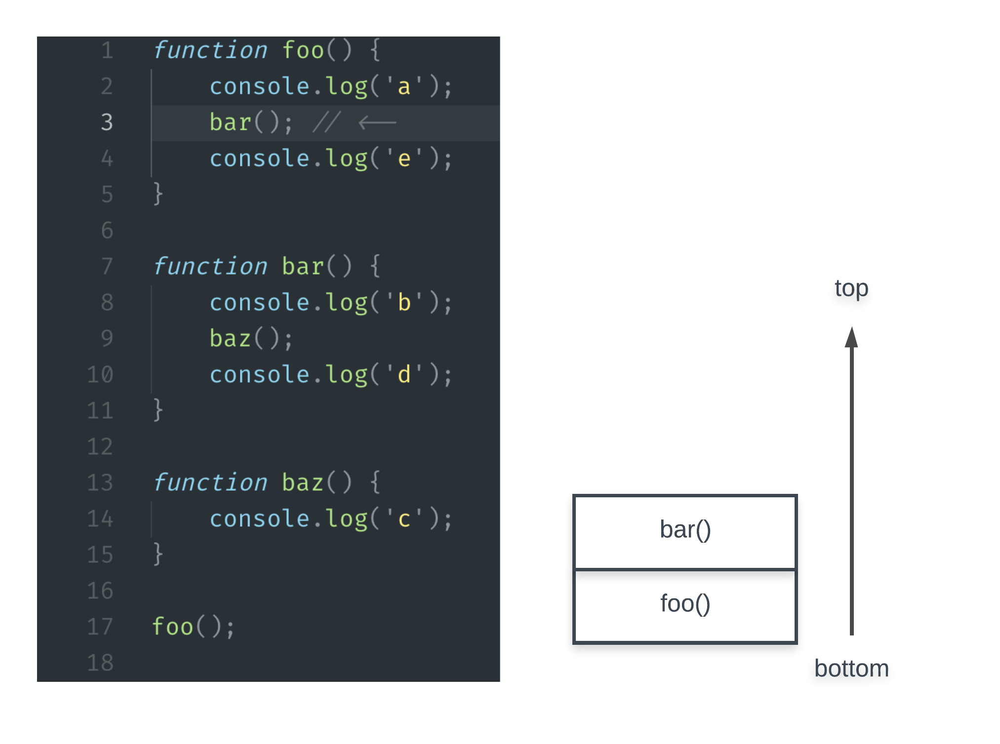
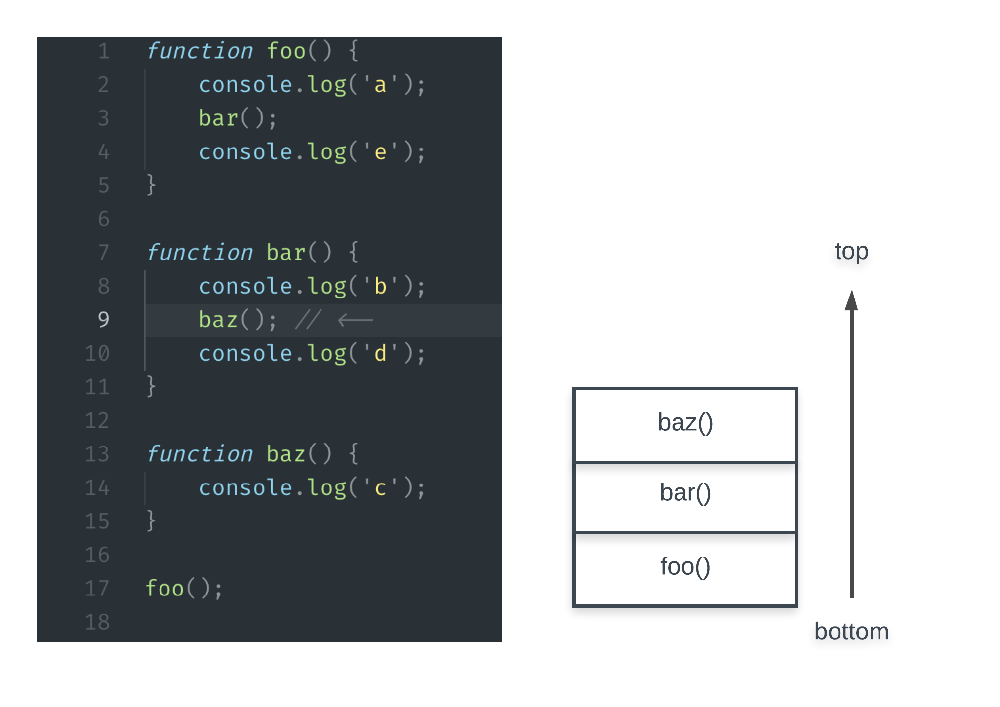
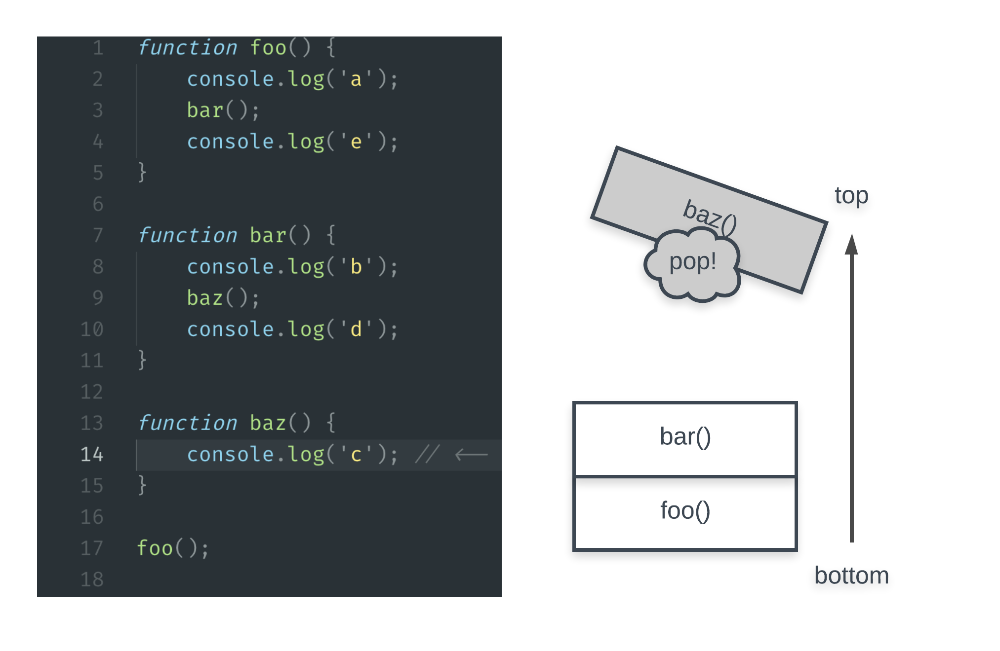
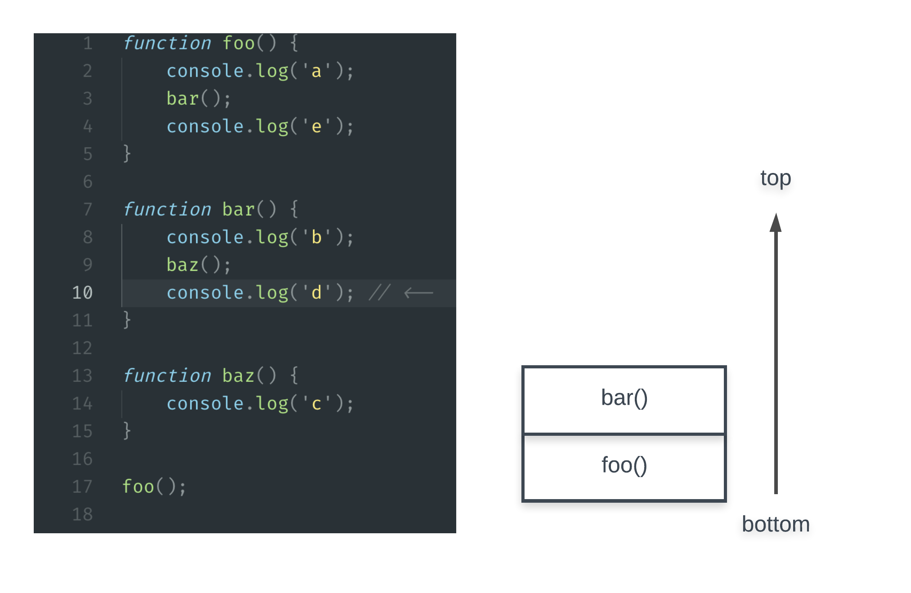
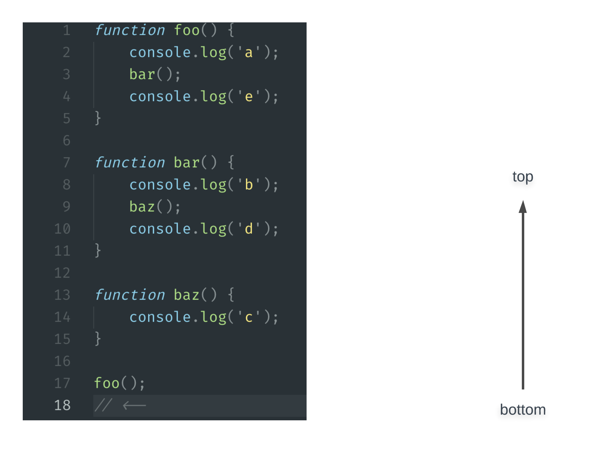

# The Call Stack

When you finish reading this article, you should be able to:

- identify the two operations that characterize a **stack** data structure
- sketch how the **call stack** is manipulated during the runtime of a simple program like the one provided in this reading

## The call stack

The **call stack** is a structure that JavaScript uses to keep track of the evaluation of function calls. It uses the **stack** data structure. In Computer Science, a "stack" is a general pattern of organizing a collection of items. For our current use of a stack, the items being organized are the function calls that occur during the execution of our program. we can imagine a stack as a vertical pile that obeys the following pattern:

- new items must be placed on top of the pile - we refer to this as **pushing** a new item to the stack
- at any point, the only item that can be removed is the top of the pile - we refer to this as **popping** the top item from the stack

In JavaScript's call stack, we use the term "stack frames" to describe the items that are being pushed and popped. With this new understanding, we can now identify two ways that JavaScript leverages these stack mechanics during runtime:

- when a function is called, a new frame is pushed onto the stack.
- when a function returns, the frame on the top of the stack is popped off the stack.

To illustrate how frames are pushed to and popped from the call stack, we'll explore the following program:

```javascript
function foo() {
	console.log('a');
	bar();
	console.log('e');
}

function bar() {
	console.log('b');
	baz();
	console.log('d');
}

function baz() {
	console.log('c');
}

foo();
```

Create a file for yourself and execute this code. It will print out the letters in order. This code is a great example of how a program's execution may not simply be top down. Instead of executing sequentially, line by line, we know that function calls and returns will cause execution to hop back and forth to different line numbers. Let's trace through this program, visualizing the stack. We'll use a commented arrow to denote where we pause execution to visualize the stack at that moment.

We begin by executing a function call, `foo()`. This will add a frame to the stack:



Now that `foo()` is the topmost (and only) frame on the stack, we must execute the code inside of that function definition. This means that we print 'a' and call `bar()`. This causes a new frame to be pushed to the stack:



Note that the stack frame for `foo()` is still on the stack, but not on top anymore. The only time a frame may entirely leave that stack is when it is popped due to a function return. Bear in mind that a function can return due to an explicit return with a literal line like `return someValue;` or it can implicitly return after the last line of the function's definition is executed. Since `bar()` is now on top of the stack, execution jumps into the definition of `bar`. You may notice the trick now: the frame that is at the top of the stack represents the function being executed currently. Back to the execution, we print 'b' and call `baz()`:



Again, notice that `bar()` remains on the stack because that function has not yet returned. Executing `baz`, we print out 'c' and return because there is no other code in the definition of `baz`. This return means that `baz()` is popped from the stack:



Now `bar()` is back on top of the stack; this makes sense because we must continue to execute the remaining code within `bar` on line 10:



'd' is printed out and `bar` returns because there is no further code within its definition. The top of the stack is popped. `foo()` is now on top, which means execution resumes inside of `foo`, line 4:


Finally, 'e' is printed and `foo` returns. This means the top frame is popped, leaving the stack empty. Once the stack is empty, our program can exit:



That completes our stack trace! Here are three key points to take away from these illustrations:

1. the frame on the top of the stack corresponds to the function currently being executed
2. calling a function will push a new frame to the top of the stack
3. returning from a function will pop the top frame from the stack

This was a high level overview of the call stack. There is some detail that we've omitted to bring attention to the most important mechanics. In particular, we've glazed over what information is actually stored inside of a single stack frame. For example, a stack frame will contain data about a specific function call such as _local variables_, _arguments_, and _which line to return to after the frame is popped_!
